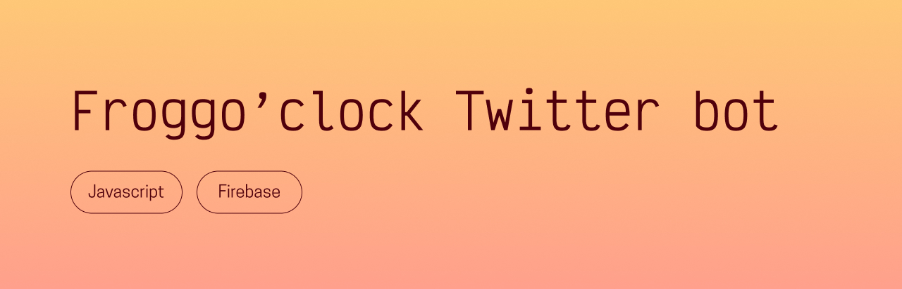

## Presentation
The goal of this bot was to tweet a frog picture from [Unsplash](https://unsplash.com/) every four hours, as many of my friends love frogs and I wanted to spread a little joy. The Twitter account it tweeted from is no longer updated, but the code lives on here, as I am still pretty proud of it! 

## Packages used
- [twitter-api-v2](https://www.npmjs.com/package/twitter-api-v2)
- [cron](https://www.npmjs.com/package/cron)
- [image-downloader](https://www.npmjs.com/package/image-downloader)
- [node-fetch](https://www.npmjs.com/package/node-fetch)

## Thanks for reading, and happy coding!  
Chloé Adrian
